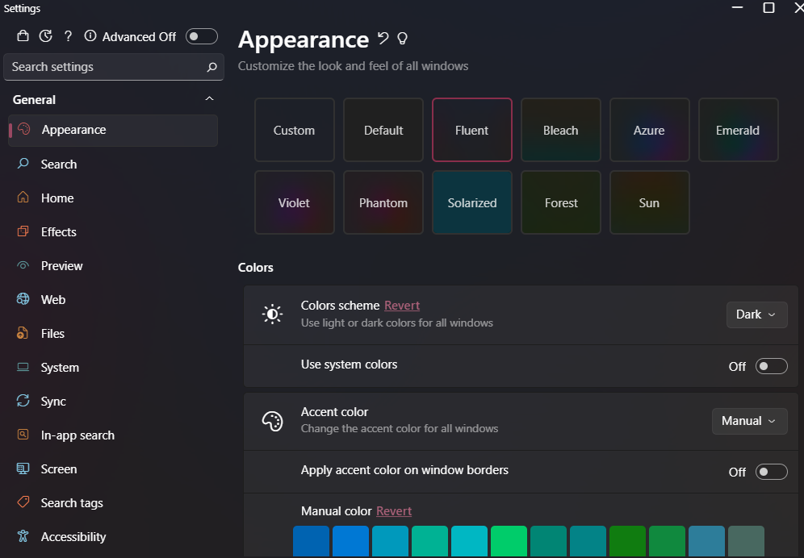

<p align="center"><a href="https://getsharex.com"></a></p>
<h1 align="center">SnapX</h1>
<h3 align="center">Capture, share, and boost productivity. All in one.</h3>
<br>
<div align="center">
  <a href="https://github.com/BrycensRanch/SnapX/actions/workflows/build.yml"></a>
  <a href="./LICENSE.txt"></a>
  <a href="https://github.com/BrycensRanch/SnapX/releases/latest"></a>
  <a href="https://getsharex.com/downloads"></a>
  <a href="https://discord.gg/ys3ZCzttVQ"></a>
</div>
<br>
<p align="center"><a href="https://github.com/BrycensRanch/SnapX"></a></p>

# :construction: This project is under development and is not ready for use. :construction:
## :warning: Disclaimer

SnapX is a [hard fork](https://producingoss.com/en/forks.html) of the application [ShareX](https://github.com/ShareX/ShareX).
- It uses [.NET 9](https://learn.microsoft.com/en-us/dotnet/core/whats-new/dotnet-9/overview), [ImageSharp](https://docs.sixlabors.com/articles/imagesharp/?tabs=tabid-1) (cross-platform image manipulation library)
- And it *will* use [SQLite](https://www.sqlite.org/about.html) to [store settings & history](https://github.com/BrycensRanch/SnapX/issues/28).
- Additionally, all uploaders are now forced to use HTTPS <2.0 & TLS 1.3 out of the box.
- Keeps compatability with the custom uploader configuration format (.sxcu)
- As a user, you do **NOT** need to have .NET installed. Whether you're on Linux, Windows, or macOS.

What does this all mean? It means you'll be able to have a more **performant**, **reliable**, and _modern_ application.

You will _not_ receive any support from the ShareX project for this software.
If you have any issues with this project, please **open an issue** in this repository.

However, it's important to note that this project is maintained by volunteers,
and we may not be able to provide support for all issues.
We will do our best to help you, but we cannot guarantee that we will be able to resolve your issue.

<p align="center">For further information, please check the source code.</p>

## Supported Linux Distributions

This project is built on Ubuntu 24.04 and is tested on the following distributions:

- Ubuntu 24.04
- Fedora 41

If you're using a different distribution, there will be a Flatpak package available when possible. If you're using a distribution that doesn't support Flatpak, you can build the project from source.

## Other platforms

When I initially started this port, I only came with one main goal: ShareX on Modern Linux on native Wayland.
I realized my work could be used on other platforms such as macOS or Windows...

That's why SnapX.Avalonia was created.

Powered by [FluentAvalonia](https://github.com/amwx/FluentAvalonia), it *can* look something like this.
Screenshot from [FluentSearch](https://github.com/adirh3/Fluent-Search): 

And yet, it runs on Windows, Linux, and macOS.
Additionally, it looks the same on every OS. (besides fonts)

For screenshotting, it uses [XCap](https://github.com/nashaofu/xcap).
## Development Dependencies

Instructions for other projects within the SnapX solution are not provided yet.

- `git`
- `gtk4-devel` on Fedora or `libgtk-4-dev` on Ubuntu
- `dotnet-sdk-9.0`
- `ffmpeg` (7.0.0)
- `clang`
- `zlib-devel`
- `rust` & `cargo` (<1.80)

### Ubuntu 24.04

```bash
sudo apt update -q && sudo apt install -y software-properties-common
sudo add-apt-repository ppa:dotnet/backports # Ubuntu 24.04 doesn't have .NET 9 packaged.
sudo add-apt-repository ppa:ubuntuhandbook1/ffmpeg7 # Ubuntu 24.04 doesn't have FFMPEG 7 packaged.
sudo apt install -y git libgtk-4-dev dotnet-sdk-9.0 ffmpeg clang zlib1g-dev libx11-dev xserver-xorg-dev xorg-dev libdbus-1-dev cargo
```

### Fedora 41

```bash
sudo dnf install -y git gtk4-devel dotnet-sdk-9.0 /usr/bin/ffmpeg clang zlib-devel @c-development @x-software-development @development-libs cargo
```

## Building from Source

Only do this if you're a developer, the solution _does_ build,
but you should have a backup of all your ShareX/SnapX data.
I do, in fact, mean it when I say the project isn't ready for use.

```bash
git clone https://github.com/BrycensRanch/SnapX
cd SnapX
./build.sh # Calls NUKE (https://nuke.build)
Output/snapx-ui/snapx-ui # Run SnapX.Avalonia
Output/snapx-gtk/snapx-gtk # Run SnapX.GTK4
# There is nothing stopping you from using regular dotnet building tools
# dotnet publish -c Release
# SnapX.Avalonia/bin/Release/net9.0/linux-x64/publish/snapx-ui
```

Lastly...

I use Fedora Rawhide btw :^)

[Fine, I'll do it myself.](https://www.youtube.com/watch?v=L_WoOkDAqbM)
